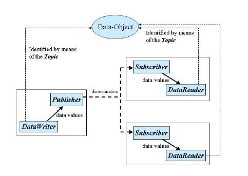
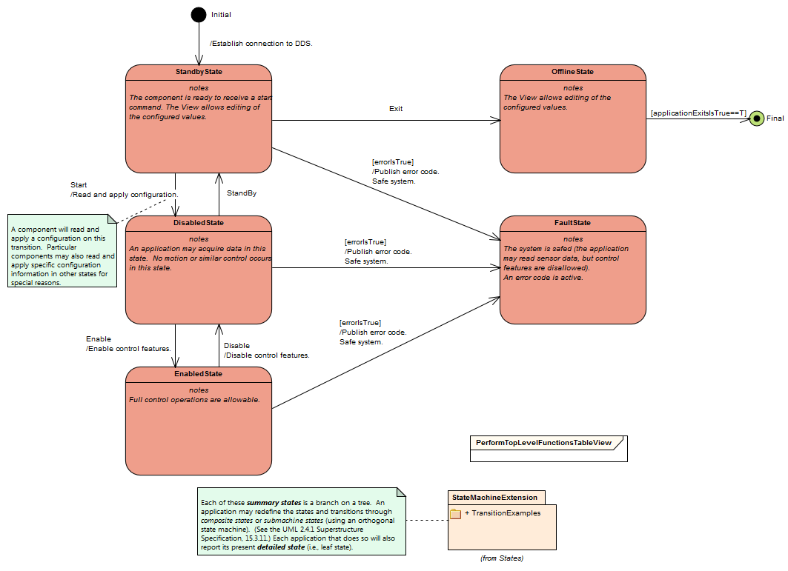
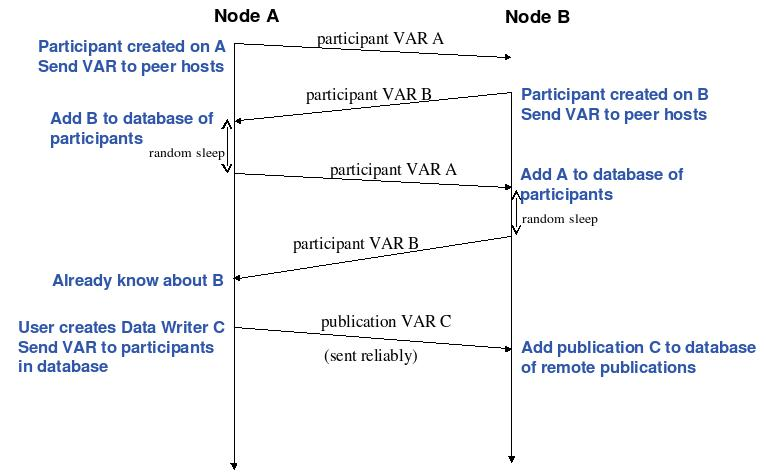

.. \_lsst.ts.introduction:

|image0|

Middleware Overview
-------------------

This document describes the middleware (software stack) used for
subsystem communications. The publish-subscribe architecture is used as
the basis. Open standards (OMG Data Distribution Service) describe the
low level protocols and API's. The OpenSplice DDS implementation is
being used to provide this framework.

An additional "Service Abstraction Layer" will provide application
developers with a simplified interface to the DDS facilities. It also
facilitates the logging of all subsystem telemetry and command history.
to the Engineering and Facility Database (EFD).

Tools are used to automatically generate communications code from
Telemetry and Command definitions, which are described using "Interface
definition Language".

A System Dictionary describes the syntax and naming schemes used in the
IDL, thus establishing system-wide consistency.

The required network bandwidth for each subsystem , and the accompanying
EFD table sizes are described.

The detailed descriptions of all the Telemetry streams and commands, are
listed in per-subsystem appendices.

Applicable Documents
--------------------

Datastream Definitions Document - Datastream Prototypes 1.7
(Document-11528)

Definition of subsystems - LSST Project WBS Dictionary (Document-985)

Documentation standards - LSST DM UML Modeling Conventions
(Document-469)

Messaging standards - OMG DDS 1.1 (Document-2233)

Service Abstraction Layer API - Middleware Service Abstraction Layer
(Document-3692)

Software coding standards LSST C++ Programming Style Guidelines
(Document-3046)

Vendor documentation - Opensplice manuals (Collection-2791)

Concept of operations
---------------------

System Overview
~~~~~~~~~~~~~~~

The publish-subscribe communications model provides a more efficient
model for broad data distribution over a network than point-to-point,
client-server, and distributed object models. Rather than each node
directly addressing other nodes to exchange data, publish-subscribe
provides a communications layer that delivers data transparently from
the nodes publishing the data to the nodes subscribing to the data.
Publishers send events to the communications layer, which in turn,
passes the events to subscribers. In this way, a single event published
by a publisher can be sent to multiple subscribers. Events are
categorized by topic, and subscribers specify the topics they are
interested in. Only events that match a subscribers topic are sent to
that subscriber. The service permits selection of a number of
quality-of-service criteria to allow applications to choose the
appropriate trade-off between reliability and performance.

The combination of Client-Server and Publish-Subscribe models leads to
the concept of Command/Action/Response model, in that the transmission
of commands is decoupled from the action that executes that command. A
command will return immediately; the action begins in a separate thread.
Figure 3 illustrate this model by means of a simplified sequence
diagram. When an application receives a command, it validates the
attributes associated with that command and immediately accepts or
rejects the command. If the command is accepted, the application then
initiates an independent internal action to meet the conditions imposed
by the command. Once those conditions have been met, an event is posted
signifying the successful completion of the action (or the unsuccessful
completion if the condition not be met). In this figure, callbacks are
implemented using the event features of the publish-subscribe model.

|image1|

Information flows with the aid of the following constructs : Publisher
and DataWriter on the sending side, Subscriber, and DataReader on the
receiving side.

A Publisher is an object responsible for data distribution. It may
publish data of different data types. A DataWriter acts as a typed4
accessor to a publisher. The DataWriter is the object the application
must use to communicate to a publisher the existence and value of
data-objects of a given type. When data-object values have been
communicated to the publisher through the appropriate data-writer, it is
the publisher's responsibility to perform the distribution (the
publisher will do this according to its own QoS, or the QoS attached to
the corresponding data-writer). A publication is defined by the
association of a data-writer to a publisher. This association expresses
the intent of the application to publish the data described by the
data-writer in the context provided by the publisher.

A Subscriber is an object responsible for receiving published data and
making it available (according to the Subscribers QoS) to the receiving
application. It may receive and dispatch data of different specified
types. To access the received data, the application must use a typed
DataReader attached to the subscriber. Thus, a subscription is defined
by the association of a data-reader with a subscriber. This association
expresses the intent of the application to subscribe to the data
described by the data-reader in the context provided by the subscriber.

Topic objects conceptually fit between publications and subscriptions.
Publications must be known in such a way that subscriptions can refer to
them unambiguously. A Topic is meant to fulfill that purpose: it
associates a name (unique in the domain), a data-type, and QoS related
to the data itself. In addition to the topic QoS, the QoS of the
DataWriter associated with that Topic and the QoS of the Publisher
associated to the DataWriter control the behavior on the publisher's
side, while the corresponding Topic, DataReader, and Subscriber QoS
control the behavior on the subscribers side.

When an application wishes to publish data of a given type, it must
create a Publisher (or reuse an already created one) and a DataWriter
with all the characteristics of the desired publication. Similarly, when
an application wishes to receive data, it must create a Subscriber (or
reuse an already created one) and a DataReader to define the
subscription.

QoS (Quality of Service) is a general concept that is used to specify
the behavior of a service. Programming service behavior by means of QoS
settings offers the advantage that the application developer only
indicates what is wanted rather than how this QoS should be achieved.
Generally speaking, QoS is comprised of several QoS policies. Each QoS
policy is then an independent description that associates a name with a
value. Describing QoS by means of a list of independent QoS policies
gives rise to more flexibility.

This specification is designed to allow a clear separation between the
publish and the subscribe sides, so that an application process that
only participates as a publisher can embed just what strictly relates to
publication. Similarly, an application process that participates only as
a subscriber can embed only what strictly relates to subscription.

Underlying any data-centric publish subscribe system is a data model.
This model defines the global data space and specifies how Publishers
and Subscribers refer to portions of this space. The data-model can be
as simple as a set of unrelated data structures, each identified by a
topic and a type. The topic provides an identifier that uniquely
identifies some data items within the global data space. The type
provides structural information needed to tell the middleware how to
manipulate the data and also allows the middleware to provide a level of
type safety. However, the target applications often require a
higher-level data model that allows expression of aggregation and
coherence relationships among data elements.

The OCS Middleware provides multiple levels of access to the
functionality provided. It is recommended that the highest level methods
be utilized whenever possible.

The access levels are :

-  SAL (Service abstraction layer)
-  OMG DDS (Data Distribution Service)
-  OMG RTPS (Real-time Publish Subscribe) - not used directly at present

Each subsequent layer provides more detailed access to the low-level
details of the configuration and control of the datastream definitions
and/or tuning of real-time behavior.

| 

SAL (Service abstraction layer)
~~~~~~~~~~~~~~~~~~~~~~~~~~~~~~~

The SAL provides the highest level of access to the Middleware
functionality.

Transparent access to telemetry and command objects residing on any
subsystem is provided via means of automatic shared memory mapping of
the underlying data objects.

The lower level objects are managed using an implementation of the OMG's
DDS.

The currently selected implementation is OpenSplice DDS, but the
existence of the SAL permits flexibility in migrating to other DDS
solutions if required.

The SAL provides direct access to only a small subset of the total
functionality provided by the DDS, reducing both the amount of code
required, and it's complexity, as seen by the application programmer.

The OMG DDS standard is an evolving entity. It is expected that the
prototype SIMD/jSIMD API's referenced below, will be replaced by agreed
OMG standards of equivalent functionality.

The SAL framework is designed to make this, and other similar
transitions, transparent to the application level developers.

The SAL Labview interface provides per-subsystem and per-datastreams
specific objects to facilitate application level publishing of all
telemetry.

The SAL also provides automatic version and temporal consistency
checking and appropriate feedback to the application level code.

SAL Tools
^^^^^^^^^

A combination of methods are provided to facilitate data definition,
command definition, and associated generation of code and documentation.

Salgenerator
^^^^^^^^^^^^

The Salgenerator tool and associated SDK provide a simple (command line
interface) method of interacting with all the tools included ih the SAL.

Invocation with no arguments will result in display of the on-line help.

::

    SAL generator tool - Usage :

        salgenerator subsystem (command [args] ...)

       where command may be

            generate - all steps to generate SAL wrappers for specified language
            validate - check the XML Telemetry/Command/LogEvent definitions
                    sal      - generate SAL wrappers for specified language : cpp, idl, java, python, pydds
                    apidoc   - generate interface documentation for the specified language : cpp, java, python
                    lib      - generate shared library
            labview  - generate LabVIEW low-level interface
            maven    - generate a maven project
            db       - generate telemetry database table

                        Arguments required are
     
                db start-time end-time interval

                        where the times are formatted like "2019-11-12 16:20:01"
                        and the interval is in seconds

            sim      - generate simulation configuration
            link     - link a SAL program
                    rpm  - generate runtime RPM
            verbose  - be more verbose ;-)

OMG DDS
~~~~~~~

The OMG Data-Distribution Service (DDS) is a specification for
publish-subscribe data-distribution systems. The purpose of the
specification is to provide a common application-level interface that
clearly defines the data-distribution service. The specification
describes the service using UML, providing a platform-independent model
that can then be mapped into a variety of concrete platforms and
programming languages.

The goal of the DDS specification is to facilitate the efficient
distribution of data in a distributed system. Participants using DDS can
read and write data efficiently and naturally with a typed interface.
Underneath, the DDS middleware will distribute the data so that each
reading participant can access the most-current values. In effect, the
service creates a global data space that any participant can read and
write. It also creates a name space to allow participants to find and
share objects.

DDS targets real-time systems; the API and QoS are chosen to balance
predictable behavior and implementation efficiency/performance.

--------------

DDS Tools
^^^^^^^^^

Code generation
^^^^^^^^^^^^^^^

The DDS standard provides an source code generation tool, the IDL
Pre-Processor (idlpp) which can generate DSS interface code for a
variety of language/environment combinations. We use the "standalone
C++", and "standalone Java" variants.

Message Translation
^^^^^^^^^^^^^^^^^^^

Opensplice Gateway

The OpenSplice Gateway provides semi-automated message translation
between a large number of middleware protocols.

By leveraging the `Apache Camel <https://camel.apache.org/>`__
integration framework and its support for over 80 connectors, the
OpenSplice Gateway is ideal for integrating DDS-interoperable
applications with proprietary as well as standards-based messaging
technologies, such as JMS and AMQP, as well as user applications
leveraging Web standards such as W3C Web Services, REST and HTML5
WebSockets.

It's potential use is still being evaluated.

Debug
^^^^^

Opensplice Tuner
^^^^^^^^^^^^^^^^

The OpenSplice Tuner is a deployment tool within PrismTech's OpenSplice
DDS suite. This tool offers total control over a deployed OpenSplice
based DDS-system from any local or remote platform that supports the
Java language.

The Java based OpenSplice Tuner tool aids the design, implementation,
test and maintenance of OpenSplice based distributed systems (the
OpenSplice Tuner is available both as a 'standalone' Java-program as
well as an Eclipse plug-in for the Productivity tool suite).

The OpenSplice Tuner's features target all lifecycle stages of
distributed system development and can be summarized as:

-  Design: During the design phase, once the information model is
   established (i.e. topics are defined and 'registered' in a runtime
   environment, which can be both a host-environment as well as a
   target-environment), the Tuner allows creation of publishers/writers
   and subscribers/readers on the fly to experiment and validate how
   this data should be treated by the middleware regarding persistence,
   durability, latency, etc.
-  Implementation: During the implementation phase, where actual
   application-level processing and distribution of this information is
   developed, the OpenSplice Tuner allows injection of test input-data
   by creating publishers and writers 'on the fly' as well as validating
   the responses by creating subscribers and readers for any produced
   topics.
-  Test: during the test phase, the total system can be monitored by
   inspection of data (by making 'snapshots' of writer- and
   reader-history caches) and behavior of readers & writers (statistics,
   like how long data has resided in the reader's cache before it was
   read) as well as monitoring of the data-distribution behavior
   (memory-usage, transport-latencies).
-  Maintenance: Maximum flexibility for planned and 'ad-hoc' maintenance
   is offered by allowing the Tuner tool (which can be executed on any
   JAVA enabled platform without the need of OpenSplice to be installed)
   to remotely connect via the web-based SOAP protocol to any
   'reachable' OpenSplice system around the world (as long a
   HTTP-connection can be established with the OpenSplice
   computing-nodes of that system). Using such a dynamic-connection,
   critical data may be logged and data-sets may be 'injected' into the
   system to be maintained (such as new settings which can be
   automatically 'persisted' using the QoS features as offered by the
   'persistence-profile supported by OpenSplice).

Opensplice Tester
^^^^^^^^^^^^^^^^^

This Java based tool is designed with the systems integrator in mind and
offers an intuitive set of features to aid his task, offering both local
operation (where the tool is running on a deployed DDS-system) as well
as remote operation (where the tool is connect over SOAP to a remotely
deployed DDS-system).

The main features of the OpenSplice Tester are:

-  Automated testing of DDS-based systems

   -  Dynamic discovery of DDS entities
   -  Domain-Specific scripting Language (DSL) for test scenario's

-  Batch execution of regression tests

   -  Debugging of distributed DDS system
   -  One-click definition of a monitoring-time-line
   -  Analysis/comparison of topics/instances & samples
   -  Virtual topic-attributes to dramatically ease analysis
   -  System-browser of DDS entities (app's/readers/writers)
   -  Connectivity and QoS-conflict monitoring/detection
   -  Statistics-monitoring of applications and services

-  Integrated IDE

   -  Syntax highlighting editor, script-executor and Sample Logger
   -  One-click relations between script, logs and timeline
   -  Optional integration of message-interfaces with DDS interactions

OMG RTPS wire protocol
~~~~~~~~~~~~~~~~~~~~~~

**The RTPS layer is NOT expected to be used directly by any project
generated code, we included a brief description for completeness.**

The Real-Time Publish Subscribe (RTPS) protocol has its roots in
industrial automation and was approved by the IEC as part of the
Real-Time Industrial Ethernet Suite IEC-PAS-62030. It is a field proven
technology that is currently deployed worldwide in thousands of
industrial devices. RTPS was specifically developed to support the
unique requirements of data-distributions systems.

As one of the application domains targeted by DDS, the industrial
automation community defined requirements for a standard publish
subscribe wire-protocol that closely match those of DDS. There is a
close synergy between DDS and the RTPS wire-protocol, both in terms of
the underlying behavioral architecture and the features of RTPS.

The RTPS protocol is designed to be able to run over multicast and
connectionless best-effort transports such as UDP/IP. The main features
of the RTPS protocol include:

-  Performance and quality-of-service properties to enable best-effort
   and reliable publish-subscribe communications for real-time
   applications over standard IP networks.
-  Fault tolerance to allow the creation of networks without single
   points of failure.
-  Extensibility to allow the protocol to be extended and enhanced with
   new services without breaking backwards compatibility and
   interoperability.
-  Plug-and-play connectivity so that new applications and services are
   automatically discovered and applications can join and leave the
   network at any time without the need for reconfiguration.
-  Reconfigurability to allow balancing the requirements for reliability
   and timeliness for each data delivery.
-  Modularity to allow simple devices to implement a subset of the
   protocol and still participate in the network.
-  Scalability to enable systems to potentially scale to very large
   networks.
-  Type-safety to prevent application programming errors from
   compromising the operation of remote nodes.

The above features make RTPS an excellent match for a DDS wire-protocol.
Given its publish subscribe roots, this is not a coincidence, as RTPS
was specifically designed for meeting the types of requirements set
forth by the DDS application domain.

This specification defines the message formats, interpretation, and
usage scenarios that underlie all messages exchanged by applications
that use the RTPS protocol.

| 

General policies
^^^^^^^^^^^^^^^^

Refer to http://dev.lsstcorp.org/trac/attachment/wiki/Security/Security
Policy documents.zip

Firewall
^^^^^^^^

A firewall's basic task is to regulate the flow of traffic between
computer networks of different trust levels. Typical examples are the
Internet which is a zone with no trust and an internal network which is
a zone of higher trust. A zone with an intermediate trust level,
situated between the Internet and a trusted internal network, is often
referred to as a perimeter network or Demilitarized zone (DMZ).

Packet filtering
^^^^^^^^^^^^^^^^

Packet filters act by inspecting the packets which represent the basic
unit of data transfer between computers on the Internet. If a packet
matches the packet filter's set of rules, the packet filter will drop
(silently discard) the packet, or reject it (discard it, and send error
responses to the source).

This type of packet filtering pays no attention to whether a packet is
part of an existing stream of traffic (it stores no information on
connection state). Instead, it filters each packet based only on
information contained in the packet itself (most commonly using a
combination of the packet's source and destination address, its
protocol, and, for TCP and UDP traffic, which comprises most internet
communication, the port number).

Because TCP and UDP traffic by convention uses well known ports for
particular types of traffic, a stateless packet filter can distinguish
between, and thus control, those types of traffic (such as web browsing,
remote printing, email transmission, file transfer), unless the machines
on each side of the packet filter are both using the same non-standard
ports. Second Generation firewalls do not simply examine the contents of
each packet on an individual basis without regard to their placement
within the packet series as their predecessors had done, rather they
compare some key parts of the trusted database packets. This technology
is generally referred to as a 'stateful firewall' as it maintains
records of all connections passing through the firewall, and is able to
determine whether a packet is the start of a new connection, or part of
an existing connection. Though there is still a set of static rules in
such a firewall, the state of a connection can in itself be one of the
criteria which trigger specific rules.

This type of firewall can help prevent attacks which exploit existing
connections, or certain Denial-of-service attacks, including the SYN
flood which sends improper sequences of packets to consume resources on
systems behind a firewall.

Private subnet
^^^^^^^^^^^^^^

Firewalls often have network address translation (NAT) functionality,
and the hosts protected behind a firewall commonly have addresses in the
private address range, as defined in RFC 1918. Firewalls often have such
functionality to hide the true address of protected hosts. Originally,
the NAT function was developed to address the limited amount of IPv4
routable addresses that could be used or assigned to companies or
individuals as well as reduce both the amount and therefore cost of
obtaining enough public addresses for every computer in an organization.
Hiding the addresses of protected devices has become an increasingly
important defense against network reconnaissance.

DDS domains
^^^^^^^^^^^

The domain is the basic construct used to bind individual applications
together for communication. A distributed application can elect to use a
single domain for all its data-centric communications.

All Data Writers and Data Readers with like data types will communicate
within this domain. DDS also has the capability to support multiple
domains, thus providing developers a system that can scale with system
needs or segregate based on different data types. When a specific data
instance is published on one domain, it will not be received by
subscribers residing on any other domains.

Multiple domains provide effective data isolation. One use case would be
for a system to be designed whereby all Command/Control related data is
exchanged via one domain while Status information is exchanged within
another. Multiple domains are also a good way to control the
introduction of new functionality into an existing system.

Commanding Requirements
-----------------------

There are two basic classes of commands used : Lifecycle commands :
commands used by OCS to control the lifecycle characteristics of
applications. Users generally do not need to be concerned with the
lifecycle commands because they are implemented by the underlying
infrastructure.

Functional commands : commands that implement the specific functional
characteristics of a subsystem components.

Functional operation is based on the Command/Action/Response model that
isolates the transmission of the command from the resulting action that
is performed. When an application receives a command, it validates any
parameter associated with that command and immediately accepts or
rejects the command. If the command is accepted, the application then
initiates an independent internal action to meet the conditions imposed
by the command. Once those conditions have been met, an event is posted
signifying the successful completion of the action (or the unsuccessful
completion if the conditions can not be met).

Commands return immediately but the actions that are initiated as a
result of a command may take some time to complete. When the action
completes, an action status event is posted that includes the completion
status of that action. The subsystem generating the command monitors
this status event prior to issuing the command on the remote system.
While the monitoring is performed automatically by the command system,
Subsystem developers may need to attach a callback to perform processing
on action completion. This callback may be null if no processing is
needed.

If a command is accepted by the subsystem it causes an independent
action to begin. A response to the command is returned immediately. The
action begins matching the current configuration to the new demand
configuration. When the configurations match (i.e., the subsystem has
performed the input operations) the action signals the successful end of
the action. If the commands cannot be matched (whether by hardware
failure, external stop command, timeout, or some other fault) the action
signals the unsuccessful end of the action.

The important features of the command/action/response model are:

-  Commands are never blocked. As soon as one command is started,
   another one can be issued. The behavior of the controller when two or
   more commands are started can be configured on a per subsystem basis.
-  The actions are performed using one or more separate threads. They
   can be tuned for priority, number of simultaneous actions, critical
   resources, or any other parameters.
-  Action completions produce events that tell the state of the current
   configuration. Actions push the lifecycle of the ccommand through to
   completion.
-  Responses may be monitored by any other subsystems.

Generic subsystem control state commands
~~~~~~~~~~~~~~~~~~~~~~~~~~~~~~~~~~~~~~~~

All subsystems support the following lifecycle commands. These are used
to initiate transitions in the subsystem state machine. All subsystem
specific commanding occurs only in the "Enabled" state.

|image2|

Interface Processing Time Requirements
~~~~~~~~~~~~~~~~~~~~~~~~~~~~~~~~~~~~~~

Command messages issued via the middleware must be received by the
computer system(s) of the commanded subsystem within 5ms. A preliminary
response (ACK) must be issued within 10ms and received by the caller
within 20ms of the command origination time.

Message Requirements
~~~~~~~~~~~~~~~~~~~~

| Every stream includes items for consistency
|  checking and performance monitoring support

Telemetry Requirements
~~~~~~~~~~~~~~~~~~~~~~

Telemetry data issued via the middleware must be received by the
computer system(s) of the Facility database , and any other subscribers
, within 20ms.

Event Notifications Requirements
~~~~~~~~~~~~~~~~~~~~~~~~~~~~~~~~

Any application may post notifications and/or subscribe to notifications
posted elsewhere. The notification service is robust and high
performance. A notification consists of a topic and a severity. A
sequence of notifications with the same topic is referred to as an
event.

The topic is used to identify publishers to subscribers. The severity
may be used as a filter by notification subscribers.

The notification service has the following general properties: An
notification topic represents a many to many mapping: notifications may
be posted to the topic from more than one source and received by zero or
more targets. (Typically, however, most topics will have a single
source.)

Notifications posted by a single source into an notification topic are
received by all targets in the same order as they were posted.

Delivery of notifications to one subscriber cannot be blocked by the
actions of another subscriber. An notification stream is an abstract
concept: a subscriber may subscribe to an notification stream using a
wildcarded name in which case the notifications it receives are the
merging of all published notifications whose names match that wildcarded
name.

Notification are not queued by the service. A late subscriber will not
see earlier notifications.

The service does not drop notifications. A published notification will
be delivered to all subscribers.

The notification service supports arbitrary notification topics.

Notifications are automatically tagged with the source and a timestamp.

Communication Methods
~~~~~~~~~~~~~~~~~~~~~

Initiation : DDS discovery
~~~~~~~~~~~~~~~~~~~~~~~~~~

The process by which domain participants find out about each others
entities Each participant maintains database on other participants in
the domain and their entities happens automatically behind the scenes
(anonymous publish-subscribe)

-  Does not cross domain boundaries
-  Dynamic discovery
-  Participants must refresh their presence in the domain or will be
   aged out of database
-  QoS changes are propagated to remote participants
-  Two consecutive phases
-  Participant discovery phase
-  Participants discover each other
-  Best-effort communication
-  Endpoint discovery phase
-  Participants exchange information about their datawriter and
   datareader entities
-  Reliable communication
-  Steady state traffic to maintain liveliness of participants
-  Participants periodically announce their presence using RTPS VAR
   message
-  Contains participant GUID, transport locators, QoS
-  Initially sent to all participants in initial peers list, then sent
   periodically to all discovered participants
-  Sent using best-effort

DataWriter/DataReader discovery

-  Send out pub/sub VAR to every new participant
-  NACK for pub/sub info if not received from a known participant
-  Send out changes/additions/deletions to each participant
-  Uses reliable communication between participants
-  Data Distribution Service matches up local and remote entities to
   establish communication paths

|image3|

Discovery is implemented using DDS entities known as Built-in Data
Writers and Built-in Data Readers

-  Uses same infrastructure as user defined Data Writers/Data Readers
-  Participant data is sent best effort
-  Publication/subscription data is sent reliably

Three Built-in topics (keyed):

-  DCPSParticipant
-  DCPSPublication
-  DCPSSubscription

Each participant on the same host and in the same domain requires a
unique participant index

For given domain, participant index determines port numbers used by the
participant

Flow Control : DDS topics
~~~~~~~~~~~~~~~~~~~~~~~~~

Topics provide the basic connection point between publishers and
subscribers. The Topic of a given publisher on one node must match the
Topic of an associated subscriber on any other node. If the Topics do
not match, communication will not take place.

A Topic is comprised of a Topic Name and a Topic Type. The Topic Name is
a string that uniquely identifies the Topic within a domain. The Topic
Type is the definition of the data contained within the Topic. Topics
must be uniquely defined within any one particular domain. Two Topics
with different Topic Names but the same Topic Type definition would be
considered two different Topics within the DDS infrastructure.

Message timestamps
~~~~~~~~~~~~~~~~~~

Message integrity is enhanced by the inclusion of egress-time and
arrival time (local system clocks) field in every topic (command ,
notification, and telemetry). The SAL software automatically performs
validation to ensure early detection of clock slew or other time related
problems.

Software versioning checksums
~~~~~~~~~~~~~~~~~~~~~~~~~~~~~

Communications consistency and security is supported by the inclusion of
CRC checksum fields in every topic definition (command , notification,
and telemetry). The SAL software automatically checks that the publisher
and subscribers are running code generated using identical (at the
source code level) topic definitions. This prevents problems associated
with maintaining consistent inter-subsystem interfaces across a widely
distributed software development infrastructure.

Qualification methods
---------------------

XML System dictionary
~~~~~~~~~~~~~~~~~~~~~

A systemwide dictionary of all subsystems, devices, actions and states
is maintained. All the interactions between subsystems are automatically
checked to verify that only objects defined in the dictionary can be
used or referenced.

Code generation
~~~~~~~~~~~~~~~

The primary implementation of the software interface described in this
document will be automatically generated. A Service Abstraction layer
(SAL) will provide a standardized wrapper for the low-level OMG DDS
functionality which provides the transport layer.

The permissible commands, datastream contents, and issuable alerts are
all defined by the controls system database and their nomenclature is
controlled by the system dictionary. All intersubsystem messages formats
are autogenerated. Low level data transfers include versioning checksums
based on the source level record definition.

Testing and simulation
~~~~~~~~~~~~~~~~~~~~~~

Test servers and clients are generated which implement the full set of
commands, datastreams, and notifications are defined by the controls
system database. Tests may be configured for a variable number of
servers/clients and automatically monitored to ensure compliance with
bandwidth and latency requirements. All test results are archived to the
facility database for future examination.

