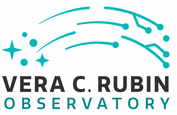
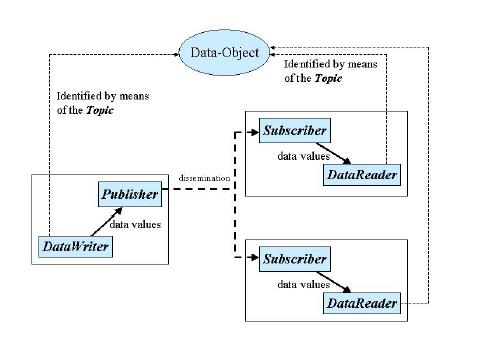
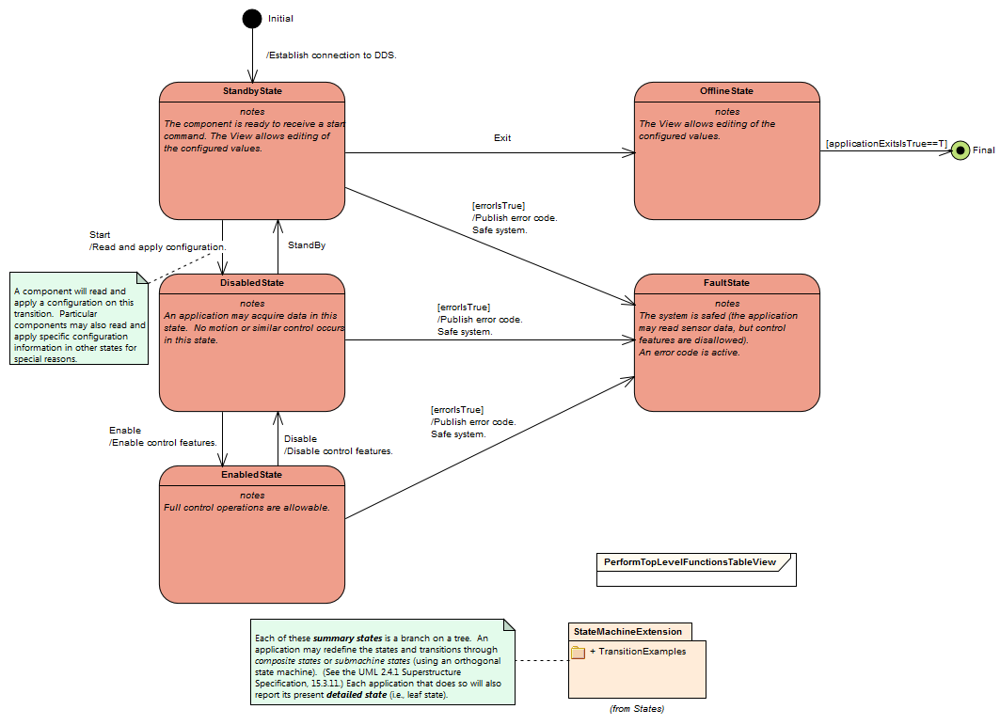

.. \_lsst.ts.introduction:

|image0|

Middleware Overview (Kafka)
----------------------------

This document describes the middleware (software stack) used for
subsystem communications. The publish-subscribe architecture is used as
the basis. 

Two versions are supported

Legacy : Open standards (OMG Data Distribution Service) describe the
low level protocols and API's. The OpenSplice DDS implementation is
being used to provide this framework. This is expected to be retired
before commisioning of the full system starts.

Latest : Open standards (Apache Avro and Kafka) describe the
low level protocols and API's. The Strimzi Kafka implementation is
being used to provide this framework.

An additional "Service Abstraction Layer" will provide application
developers with a simplified interface to the low-level facilities. It also
facilitates the logging of all subsystem telemetry and command history.
to the Engineering and Facility Database (EFD).

Tools are used to automatically generate communications code from
Telemetry and Command definitions, which are described using "Interface
definition Language".

A System Dictionary describes the syntax and naming schemes used in the
IDL (Legacy) or Avro (current), thus establishing system-wide consistency.

The required network bandwidth for each subsystem , and the accompanying
EFD table sizes are described.

The detailed descriptions of all the Telemetry streams and commands, are
listed in per-subsystem appendices.

Applicable Documents
~~~~~~~~~~~~~~~~~~~~

-  Definition of subsystems - LSST Project WBS Dictionary (Document-985)
-  Documentation standards - LSST DM UML Modeling Conventions
   (Document-469)
-  Software coding standards LSST C++ Programming Style Guidelines
   (Document-3046)
-  Observatory System Specifications - LSE-30
-  TCS Communication Protocol Interface - LTS-306
-  TCS Software Component Interface - LTS-307

System Overview
~~~~~~~~~~~~~~~

The publish-subscribe communications model provides a more efficient
model for broad data distribution over a network than point-to-point,
client-server, and distributed object models. Rather than each node
directly addressing other nodes to exchange data, publish-subscribe
provides a communications layer that delivers data transparently from
the nodes publishing the data to the nodes subscribing to the data.
Publishers send events to the communications layer, which in turn,
passes the events to subscribers. In this way, a single event published
by a publisher can be sent to multiple subscribers. Events are
categorized by topic, and subscribers specify the topics they are
interested in. Only events that match a subscribers topic are sent to
that subscriber. The service permits selection of a number of
quality-of-service criteria to allow applications to choose the
appropriate trade-off between reliability and performance.

The combination of Client-Server and Publish-Subscribe models leads to
the concept of Command/Action/Response model, in that the transmission
of commands is decoupled from the action that executes that command. A
command will return immediately; the action begins in a separate thread.
Figure 3 illustrate this model by means of a simplified sequence
diagram. When an application receives a command, it validates the
attributes associated with that command and immediately accepts or
rejects the command. If the command is accepted, the application then
initiates an independent internal action to meet the conditions imposed
by the command. Once those conditions have been met, an event is posted
signifying the successful completion of the action (or the unsuccessful
completion if the condition not be met). In this figure, callbacks are
implemented using the event features of the publish-subscribe model.

|image1|

Information flows with the aid of the following constructs : Publisher
and Writer/Producer on the sending side, Subscriber, and Reader/Consumer on the
receiving side.

A Publisher is an object responsible for data distribution. It may
publish data of different data types. A Writer acts as a typed
accessor to a publisher. The Writer is the object the application
must use to communicate to a publisher the existence and value of
data-objects of a given type. When data-object values have been
communicated to the publisher through the appropriate Writer, it is
the publisher's responsibility to perform the distribution . 
A publication is defined by the
association of a Writer to a publisher. This association expresses
the intent of the application to publish the data described by the
Writer in the context provided by the publisher.

A Subscriber is an object responsible for receiving published data and
making it available to the receiving
application. It may receive and dispatch data of different specified
types. To access the received data, the application must use a typed
Reader attached to the subscriber. Thus, a subscription is defined
by the association of a data-reader with a subscriber. This association
expresses the intent of the application to subscribe to the data
described by the data-reader in the context provided by the subscriber.

Topic objects conceptually fit between publications and subscriptions.
Publications must be known in such a way that subscriptions can refer to
them unambiguously. A Topic is meant to fulfill that purpose: it
associates a name (unique in the domain), and data-schema.

When an application wishes to publish data of a given type, it must
create a Publisher (or reuse an already created one) and a Writer
with all the characteristics of the desired publication. Similarly, when
an application wishes to receive data, it must create a Subscriber (or
reuse an already created one) and a Reader to define the
subscription.

This specification is designed to allow a clear separation between the
publish and the subscribe sides, so that an application process that
only participates as a publisher can embed just what strictly relates to
publication. Similarly, an application process that participates only as
a subscriber can embed only what strictly relates to subscription.

Underlying any data-centric publish subscribe system is a data model.
This model defines the global data space and specifies how Publishers
and Subscribers refer to portions of this space. The data-model can be
as simple as a set of unrelated data structures, each identified by a
topic and a type. The topic provides an identifier that uniquely
identifies some data items within the global data space. The type
provides structural information needed to tell the middleware how to
manipulate the data and also allows the middleware to provide a level of
type safety. However, the target applications often require a
higher-level data model that allows expression of aggregation and
coherence relationships among data elements.

The OCS Middleware provides multiple levels of access to the
functionality provided. It is recommended that the highest level methods
be utilized whenever possible.

The access levels are :

-  SAL (Service abstraction layer)
-  Apache Kafka

Each layer provides more detailed access to the low-level
details of the configuration and control of the datastream definitions
and/or tuning of real-time behavior.

| 

SAL (Service abstraction layer)
~~~~~~~~~~~~~~~~~~~~~~~~~~~~~~~

The SAL provides the highest level of access to the Middleware
functionality.

Transparent access to telemetry and command objects residing on any
subsystem is provided via means of automatic shared memory mapping of
the underlying data objects.

The lower level objects are managed using an implementation of Apache Kafka.

The SAL provides direct access to only a small subset of the total
functionality provided by the transport layers, reducing both the amount of code
required, and it's complexity, as seen by the application programmer.

The SAL framework is designed to make this, and other similar
transitions, transparent to the application level developers.

The SAL Labview interface provides per-subsystem and per-datastreams
specific objects to facilitate application level publishing of all
telemetry.

The SAL also provides automatic version and temporal consistency
checking and appropriate feedback to the application level code.

SAL Tools
^^^^^^^^^

A combination of methods are provided to facilitate data definition,
command definition, and associated generation of code and documentation.

Salgenerator
^^^^^^^^^^^^

The Salgenerator tool and associated SDK provide a simple (command line
interface) method of interacting with all the tools included ih the SAL.

Invocation with no arguments will result in display of the on-line help.

::

    SAL generator tool - Usage :

        salgenerator subsystem (command [args] ...)

       where command may be

            generate - all steps to generate SAL wrappers for specified language
            validate - check the XML Telemetry/Command/LogEvent definitions
            sal      - generate SAL wrappers for specified language : cpp, java
            apidoc   - generate interface documentation for the specified language : cpp, java
            lib      - generate shared library
            labview  - generate LabVIEW low-level interface
            maven    - generate a maven project
            rpm      - generate runtime RPM
            verbose  - be more verbose ;-)

.. note::
   **TODO**: Add Kafka introduction here

Kafka is a distributed system consisting of servers and clients that communicate via a high-performance TCP network protocol. It can be deployed on bare-metal hardware, virtual machines, and containers in on-premise as well as cloud environments.

Servers: Kafka is run as a cluster of one or more servers that can span multiple datacenters or cloud regions. Some of these servers form the storage layer, called the brokers. Other servers run Kafka Connect to continuously import and export data as event streams to integrate Kafka with your existing systems such as relational databases as well as other Kafka clusters. To let you implement mission-critical use cases, a Kafka cluster is highly scalable and fault-tolerant: if any of its servers fails, the other servers will take over their work to ensure continuous operations without any data loss.

Clients: They allow you to write distributed applications and microservices that read, write, and process streams of events in parallel, at scale, and in a fault-tolerant manner even in the case of network problems or machine failures. Kafka ships with some such clients included, which are augmented by dozens of clients provided by the Kafka community: clients are available for Java and Scala including the higher-level Kafka Streams library, for Go, Python, C/C++, and many other programming languages as well as REST APIs.

Refer to https://kafka.apache.org/documentation/#gettingStarted for much more detail.

General policies
^^^^^^^^^^^^^^^^

Refer to http://dev.lsstcorp.org/trac/attachment/wiki/Security/Security
Policy documents.zip

Firewall
^^^^^^^^

A firewall's basic task is to regulate the flow of traffic between
computer networks of different trust levels. Typical examples are the
Internet which is a zone with no trust and an internal network which is
a zone of higher trust. A zone with an intermediate trust level,
situated between the Internet and a trusted internal network, is often
referred to as a perimeter network or Demilitarized zone (DMZ).

Packet filtering
^^^^^^^^^^^^^^^^

Packet filters act by inspecting the packets which represent the basic
unit of data transfer between computers on the Internet. If a packet
matches the packet filter's set of rules, the packet filter will drop
(silently discard) the packet, or reject it (discard it, and send error
responses to the source).

This type of packet filtering pays no attention to whether a packet is
part of an existing stream of traffic (it stores no information on
connection state). Instead, it filters each packet based only on
information contained in the packet itself (most commonly using a
combination of the packet's source and destination address, its
protocol, and, for TCP and UDP traffic, which comprises most internet
communication, the port number).

Because TCP and UDP traffic by convention uses well known ports for
particular types of traffic, a stateless packet filter can distinguish
between, and thus control, those types of traffic (such as web browsing,
remote printing, email transmission, file transfer), unless the machines
on each side of the packet filter are both using the same non-standard
ports. Second Generation firewalls do not simply examine the contents of
each packet on an individual basis without regard to their placement
within the packet series as their predecessors had done, rather they
compare some key parts of the trusted database packets. This technology
is generally referred to as a 'stateful firewall' as it maintains
records of all connections passing through the firewall, and is able to
determine whether a packet is the start of a new connection, or part of
an existing connection. Though there is still a set of static rules in
such a firewall, the state of a connection can in itself be one of the
criteria which trigger specific rules.

This type of firewall can help prevent attacks which exploit existing
connections, or certain Denial-of-service attacks, including the SYN
flood which sends improper sequences of packets to consume resources on
systems behind a firewall.

Private subnet
^^^^^^^^^^^^^^

Firewalls often have network address translation (NAT) functionality,
and the hosts protected behind a firewall commonly have addresses in the
private address range, as defined in RFC 1918. Firewalls often have such
functionality to hide the true address of protected hosts. Originally,
the NAT function was developed to address the limited amount of IPv4
routable addresses that could be used or assigned to companies or
individuals as well as reduce both the amount and therefore cost of
obtaining enough public addresses for every computer in an organization.
Hiding the addresses of protected devices has become an increasingly
important defense against network reconnaissance.

Kafka namespace
^^^^^^^^^^^^^^^

The namespace is the basic construct used to bind individual applications
together for communication. A distributed application can elect to use a
single namepsace for all its data-centric communications.

All Data Writers and Data Readers with like data types will communicate
within this namespace.

Commanding Requirements
~~~~~~~~~~~~~~~~~~~~~~~

There are two basic classes of commands used : Lifecycle commands :
commands used by OCS to control the lifecycle characteristics of
applications. Users generally do not need to be concerned with the
lifecycle commands because they are implemented by the underlying
infrastructure.

Functional commands : commands that implement the specific functional
characteristics of a subsystem components.

Functional operation is based on the Command/Action/Response model that
isolates the transmission of the command from the resulting action that
is performed. When an application receives a command, it validates any
parameter associated with that command and immediately accepts or
rejects the command. If the command is accepted, the application then
initiates an independent internal action to meet the conditions imposed
by the command. Once those conditions have been met, an event is posted
signifying the successful completion of the action (or the unsuccessful
completion if the conditions can not be met).

Commands return immediately but the actions that are initiated as a
result of a command may take some time to complete. When the action
completes, an action status event is posted that includes the completion
status of that action. The subsystem generating the command monitors
this status event prior to issuing the command on the remote system.
While the monitoring is performed automatically by the command system,
Subsystem developers may need to attach a callback to perform processing
on action completion. This callback may be null if no processing is
needed.

If a command is accepted by the subsystem it causes an independent
action to begin. A response to the command is returned immediately. The
action begins matching the current configuration to the new demand
configuration. When the configurations match (i.e., the subsystem has
performed the input operations) the action signals the successful end of
the action. If the commands cannot be matched (whether by hardware
failure, external stop command, timeout, or some other fault) the action
signals the unsuccessful end of the action.

The important features of the command/action/response model are:

-  Commands are never blocked. As soon as one command is started,
   another one can be issued. The behavior of the controller when two or
   more commands are started can be configured on a per subsystem basis.
-  The actions are performed using one or more separate threads. They
   can be tuned for priority, number of simultaneous actions, critical
   resources, or any other parameters.
-  Action completions produce events that tell the state of the current
   configuration. Actions push the lifecycle of the ccommand through to
   completion.
-  Responses may be monitored by any other subsystems.

Generic subsystem control state commands
~~~~~~~~~~~~~~~~~~~~~~~~~~~~~~~~~~~~~~~~

All subsystems support the following lifecycle commands. These are used
to initiate transitions in the subsystem state machine. All subsystem
specific commanding occurs only in the "Enabled" state.

-  [CSC-name]>\_command\_abort
-  [CSC-name]>\_command\_enable
-  [CSC-name]>\_command\_disable
-  [CSC-name]>\_command\_standby
-  [CSC-name]>\_command\_exitControl
-  [CSC-name]>\_command\_start
-  [CSC-name]>\_command\_enterControl
-  [CSC-name]>\_command\_setLogLevel
-  [CSC-name]>\_command\_setValue

Generic subsystem logging events
~~~~~~~~~~~~~~~~~~~~~~~~~~~~~~~~

-  [CSC-name]>\_logevent\_settingVersions
-  [CSC-name]>\_logevent\_errorCode
-  [CSC-name]>\_logevent\_summaryState
-  [CSC-name]>\_logevent\_appliedSettingsMatchStart
-  [CSC-name]>\_logevent\_logLevel
-  [CSC-name]>\_logevent\_logMessage
-  [CSC-name]>\_logevent\_settingsApplied
-  [CSC-name]>\_logevent\_simulationMode
-  [CSC-name]>\_logevent\_softwareVersions
-  [CSC-name]>\_logevent\_heartbeat

|image2|

Interface Processing Time Requirements
~~~~~~~~~~~~~~~~~~~~~~~~~~~~~~~~~~~~~~

Command messages issued via the middleware must be received by the
computer system(s) of the commanded subsystem within 5ms. A preliminary
response (ACK) must be issued within 10ms and received by the caller
within 20ms of the command origination time.

Message Requirements
~~~~~~~~~~~~~~~~~~~~

| Every stream includes items for consistency
|  checking and performance monitoring support

Telemetry Requirements
~~~~~~~~~~~~~~~~~~~~~~

Telemetry data issued via the middleware must be received by the
computer system(s) of the Engineering and Facility database , and any other subscribers
, within 20ms.

Event Notifications Requirements
~~~~~~~~~~~~~~~~~~~~~~~~~~~~~~~~

Any application may post notifications and/or subscribe to notifications
posted elsewhere. The notification service is robust and high
performance. A notification consists of a topic and a severity. A
sequence of notifications with the same topic is referred to as an
event.

The topic is used to identify publishers to subscribers. The severity
may be used as a filter by notification subscribers.

The notification service has the following general properties: An
notification topic represents a many to many mapping: notifications may
be posted to the topic from more than one source and received by zero or
more targets. (Typically, however, most topics will have a single
source.)

Notifications posted by a single source into an notification topic are
received by all targets in the same order as they were posted.

Delivery of notifications to one subscriber cannot be blocked by the
actions of another subscriber. An notification stream is an abstract
concept: a subscriber may subscribe to an notification stream using a
wildcarded name in which case the notifications it receives are the
merging of all published notifications whose names match that wildcarded
name.

Notification are not queued by the service. A late subscriber will not
see earlier notifications.

The service does not drop notifications. A published notification will
be delivered to all subscribers.

The notification service supports arbitrary notification topics.

Notifications are automatically tagged with the source and a timestamp.

Communication Methods
~~~~~~~~~~~~~~~~~~~~~

Flow Control : Kafka topics
~~~~~~~~~~~~~~~~~~~~~~~~~~~

Topics provide the basic connection point between publishers and
subscribers. The Topic of a given publisher on one node must match the
Topic of an associated subscriber on any other node. If the Topics do
not match, communication will not take place.

A Topic is comprised of a Topic Name and a Topic Schema (Avro). The Topic Name is
a string that uniquely identifies the Topic within a domain. The Topic
Schema is the definition of the data contained within the Topic. Topics
must be uniquely defined within any one particular namespace.

Message timestamps
~~~~~~~~~~~~~~~~~~

Message integrity is enhanced by the inclusion of egress-time and
arrival time (local system clocks) field in every topic (command ,
notification, and telemetry). The SAL software automatically performs
validation to ensure early detection of clock slew or other time related
problems.

Software versioning checksums
~~~~~~~~~~~~~~~~~~~~~~~~~~~~~

Communications consistency and security is supported by the inclusion of
CRC checksum fields in every topic definition (command , notification,
and telemetry). The SAL software automatically checks that the publisher
and subscribers are running code generated using identical (at the
source code level) topic definitions. This prevents problems associated
with maintaining consistent inter-subsystem interfaces across a widely
distributed software development infrastructure.

Qualification methods
~~~~~~~~~~~~~~~~~~~~~

XML System dictionary

A systemwide dictionary of all subsystems, devices, actions and states
is maintained. All the interactions between subsystems are automatically
checked to verify that only objects defined in the dictionary can be
used or referenced.

Code generation

The primary implementation of the software interface described in this
document will be automatically generated. A Service Abstraction layer
(SAL) will provide a standardized wrapper for the low-level Kafka
functionality which provides the transport layer.

The permissible commands, datastream contents, and issuable alerts are
all defined by the controls system database and their nomenclature is
controlled by the system dictionary. All intersubsystem messages formats
are autogenerated. Low level data transfers include versioning checksums
based on the source level record definition.

Testing and simulation

Test servers and clients are generated which implement the full set of
commands, datastreams, and notifications are defined by the controls
system database. Tests may be configured for a variable number of
servers/clients and automatically monitored to ensure compliance with
bandwidth and latency requirements. All test results are archived to the
facility database for future examination.

